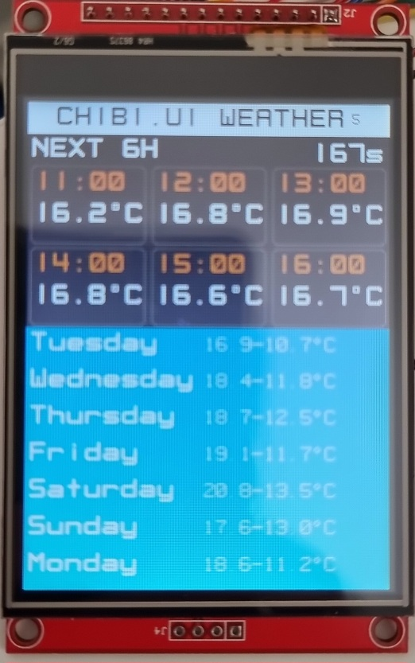

# chibi.ui

Small WPF/Avalonia style UI framework targeting Meadow platform. Tested to work on Desktop and F7v2. 
Quite a lot of "code" was borrowed from Avalonia and stripped of anything extra.

## Weather sample application

This sample application loads weather data and displays the forecast for next 6 hours and for next 7 days. 
Both Weather (Desktop) and Weather.F7 launchers are included.

For F7 please provide a valid wifi config file with valid credentials.
